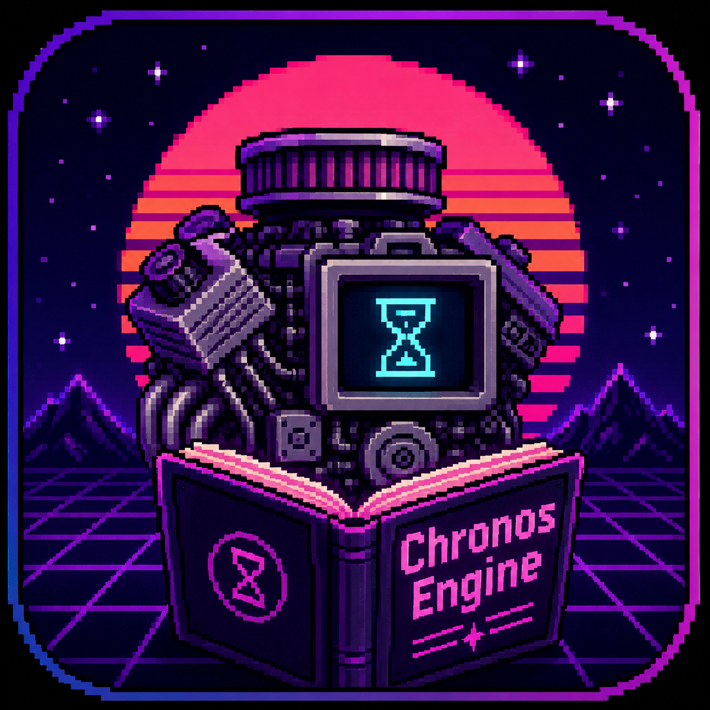

<p align="center">
  
</p>

<h1 align="center">Chronos Engine</h1>

<p align="center">
  <strong>The open-source game engine. Rust-powered. Cross-platform. For every game.</strong>
</p>

<p align="center">
  
  
  
  
  
  
</p>

---

> *"Write the future in the present while preserving the past."*

Born from the VHS static of 1984. Forged in Rust. Chronos Engine is an **open-source alternative to Unity and Unreal** — a general-purpose game engine designed for every genre. RTS, platformer, RPG, shooter, sim, puzzle — the engine doesn't care about your genre. It gives you entities, components, systems, and **determinism**.

Every byte of storage, every archetype migration, every event dispatch — hand-wired. No Bevy. No Legion. No shortcuts. The ECS core is **zero-dependency** (pure `std`). Subsystems are feature-gated: pull in only what you need. A 2D platformer ships without 3D physics. A puzzle game ships without audio.

---

## Table of Contents

- [What's Inside](#whats-inside)
- [Architecture](#architecture)
- [Quick Start](#quick-start)
- [Feature Flags](#feature-flags)
- [Project Structure](#project-structure)
- [Chronos Company](#chronos-company--demo-game)
- [Editor Application](#editor-application)
- [Engine Generalization](#engine-generalization)
- [Scripting & Modding](#scripting--modding)
- [Asset Pipeline](#asset-pipeline)
- [Comparison](#how-it-compares)
- [Roadmap](#roadmap)
- [Architecture Principles](#architecture-principles)
- [License](#license)

---

## What's Inside

**~53,000 lines** of Rust across **96 source files**. **971 tests** (946 unit + 25 integration). `cargo build --features full` compiles clean with zero errors and zero warnings.

### ECS Core

The foundation. Zero dependencies. Pure `std` library Rust.

| Layer | What | Why It Matters |
|-------|------|---------------|
| **Entity** | Generational IDs with slot reuse — freed slots recycled with incremented generations | Stale handles **never** alias live entities. Use-after-free is impossible by construction. |
| **Component** | Blanket impl trait — any `Send + Sync + 'static` type is a component | No macros, no registration ceremony. Just attach your type. |
| **Storage** | Type-erased `Box<dyn Any>` per-component storage via `TypeId` | Maximally simple. Zero unsafe. Cache-hostile but correct. |
| **Archetypes** | `ArchetypeKey` (sorted `Vec<TypeId>`) → `Archetype` (entity group) | Multi-component queries skip entities that can't match. |
| **World** | Central registry: entity lifecycle, component attach/detach, archetype tracking, slot reuse | One-stop shop for all ECS operations. |

**Built-in components:** `Position`, `Velocity`, `Health`, `Damage`, `Dead`, `Transform`, `Sprite`, `CircleRadius`, `RigidBody`, `Grounded`, `Gravity`.

### Spatial Indexing

| Module | What |
|--------|------|
| **Quadtree** | 2D spatial index — O(n log n) insertion, O(k + log n) range query, cross-subtree collision support |
| **Octree** | 3D spatial index — AABB3D, recursive 8-child subdivision, sphere/AABB/ray queries |
| **AABB / AABB3D** | 2D and 3D bounding boxes with overlap/containment checks |
| **Ray / Ray3D** | Origin + direction for spatial queries with hit detection |

### Systems & Scheduling

| System | What |
|--------|------|
| **MovementSystem** | `Position += Velocity × dt` |
| **HealthSystem** | Damage → Health → Dead pipeline with events |
| **CollisionSystem** | Quadtree broad-phase + circle narrow-phase |
| **GravitySystem** | Gravity acceleration (g×dt) |
| **PlatformerSystem** | Ground check, jump impulse, friction |
| **RaycastSystem** | Point queries and ray casting via spatial index |
| **DeathCleanupSystem** | Remove entities with Dead component |
| **DebugRenderSystem** | Terminal grid renderer — no GPU needed |

| Scheduler | Use Case |
|-----------|----------|
| **GameLoop** | Variable-framerate (platformers, RPGs, FPS) — 5-phase pipeline: PreUpdate → Update → PostUpdate → Cleanup → Render |
| **TickScheduler** | Deterministic fixed-timestep (RTS, strategy, sims) — same inputs → same outputs, every time |

### Event Bus

`EventBus` with `VecDeque<Event>` for cross-system communication. Six event types: `Collision`, `DamageTaken`, `EntityDied`, `EntityDestroyed`, `RayHit`, `Custom`. Systems emit; game code drains between frames.

### Input System

Full multi-device input with context-based action bindings.

| Feature | What |
|---------|------|
| **Keyboard** | 80+ `KeyCode` variants |
| **Mouse** | Position, delta, scroll — accumulated per-frame |
| **Gamepad** | `GamepadButton` + `GamepadAxis` (sticks, triggers) |
| **Action bindings** | Map any input to named actions. Chainable `.or()` API: `"move_forward" → W, ArrowUp, LeftStickUp` |
| **Axis support** | Analog thumbsticks, mouse delta, scroll via `AxisBinding` |
| **Context switching** | Swap input maps per game state (gameplay, menu, console) |
| **State tracking** | `pressed`, `just_pressed`, `just_released`, `held` per action per frame |

### 2D Rendering (`render` feature)

wgpu 23 sprite batch renderer with instanced drawing.

| Module | What |
|--------|------|
| **Renderer** | Full wgpu pipeline, sprite instancing, camera with orthographic projection + screen shake |
| **TextureAtlas** | GPU texture atlas management with frame extraction |
| **BitmapFont** | ASCII grid glyph atlas, kerning, `render_text()` → `Vec<RenderSprite>` |
| **TileMap** | Chunked 16×16 grids with frustum culling |
| **ParticleSystem** | ECS-integrated particles with explosion/smoke/trail presets |
| **PostProcessor** | Color grading pipeline — brightness, contrast, saturation, gamma, vignette, bloom. Presets: default, CRT, noir, sunset |

### 3D Rendering (`render` feature)

| Module | What |
|--------|------|
| **Renderer3D** | Depth buffer, perspective camera, mesh pipeline, directional lighting, back-face culling |
| **Mesh3D** | Cube/plane primitives with vertex normals |
| **Transform3D** | TRS → model matrix computation |
| **ObjLoader** | Wavefront .obj parser — vertex/normal/UV/face parsing, fan triangulation |

### Physics (2D + 3D)

| Module | What |
|--------|------|
| **PhysicsWorld2D** | Full 2D rigid body simulation — AABB/circle colliders, impulse-based contact solver, raycasting |
| **PhysicsWorld3D** | 3D rigid body simulation — static/dynamic bodies, sphere/AABB colliders |
| **Collision response** | Impulse-based with restitution + friction |
| **Constraints** | `DistanceConstraint`, `PointConstraint` — joint-like connections (3D) |
| **Gravity integration** | Per-body gravity with semi-implicit Euler |

### Animation & Materials

| Module | What |
|--------|------|
| **AnimationStateMachine** | States, transitions, parameters (bool/float/trigger) for character behavior |
| **AnimationBlendTree** | 1D/2D blending (idle→walk→run), additive animation layers |
| **SpriteAnimation** | Sprite sheet flipbook with frame events |
| **TimelineSystem** | Keyframe interpolation (linear/bezier/step), event tracks |
| **Skeletal Animation** | Joint hierarchy, `JointPose` (TRS), quaternion SLERP, `AnimationClip`, `AnimationBlender` for cross-fade |
| **MaterialDefinition** | Albedo, normal, metallic, roughness, emissive, opacity — 7 built-in presets (Unlit, PBR, Sprite, Particle, UI, Skybox, Terrain) |
| **ShaderGraph** | Node-based shader description — 28 shader node types, WGSL codegen, hot-reload watcher |

### Advanced Systems

| Module | What |
|--------|------|
| **Lighting** | 2D lighting — Point, Directional, Spot, Area lights. Shadow casting via `ShadowCaster`. Visibility polygon computation. `LightMap` for scene-wide lighting. |
| **Fog of War** | `FogGrid` with Unexplored/Explored/Visible states. `FogRevealer` for line-of-sight. `WallSegment` obstacles block visibility. |
| **UI** | Immediate-mode widgets — Button, Slider, Label, Panel. Hit-testing, `UiContext`, style presets (dark/light/accent). |
| **Camera2D** | Orthographic camera with shake, follow, bounds |
| **TilemapEx** | Layered tilemap with collision tiles, autotile |
| **Pathfinder2D** | A* on tilemap grids with variable cost |
| **AudioZone** | Spatial audio regions, reverb zones, occlusion, footstep tracking |

### Audio (`audio` feature)

Rodio 0.20 backend.

| Module | What |
|--------|------|
| **AudioEngine** | Device init, output stream management |
| **SfxPlayer** | Load .wav/.ogg, play one-shot sounds with volume |
| **MusicPlayer** | Stream long audio with crossfade support |
| **VolumeControl** | Master, Music, SFX independent channels |
| **SpatialAudio** | Position-based inverse distance attenuation |
| **SoundBuffer** | Byte cache — reuse buffers, avoid per-play allocations |

### Scene System (`serialize` feature)

JSON scene/level serialization with `serde_json`.

| Module | What |
|--------|------|
| **Scene** | Named collection of `EntityPrefab`s with metadata |
| **EntityPrefab** | Template: component list with default values |
| **ComponentValue** | 11 variants matching all built-in components — round-trip JSON |
| **World integration** | `world.spawn_prefab(scene, prefab_name)` |

### Asset Pipeline (`dev-tools` feature)

| Module | What |
|--------|------|
| **Asset trait** | `fn load(path) -> Result<Self>` for any asset type |
| **AssetRegistry** | Path → loaded asset with handle-based access |
| **HotReloadWatcher** | notify 7 file watcher — reload changed assets at runtime |
| **AssetLoader** | File I/O with format detection, combines registry + watcher |

### Developer Overlay (`render` feature)

| Module | What |
|--------|------|
| **DevOverlay** | In-game toggleable dev tools panel |
| **EntityInspector** | Show all components on selected entity with live values (11 component types) |
| **StatsPanel** | FPS ring buffer, entity count, draw calls, memory |
| **DevConsole** | Command parser + capped log output |
| **SceneTree** | Hierarchical entity list with selection |

---

## Architecture

```
┌──────────────────────────────────────────────────────────────────┐
│               Chronos Editor (Phases 7–9)                        │
│  Panels: Viewport │ Hierarchy │ Inspector │ Assets │ Console     │
│  Workspace: Undo │ Grid │ Gizmo │ Selection │ Shortcuts          │
│  Project: New/Open/Save │ Templates │ Recent │ Docking           │
├──────────────────────────────────────────────────────────────────┤
│                     Scripting Layer                               │
│   Rhai Bridge │ Script Components │ Lifecycle │ Hot-Reload       │
│   Script API: Entities │ Queries │ Input │ Audio │ Physics       │
│   Modding: ModLoader │ ModBuilder │ Sandboxing                   │
├──────────────────────────────────────────────────────────────────┤
│                        Game Code                                  │
│                  (your game logic here)                            │
├──────────────────────────────────────────────────────────────────┤
│                      Game Module                                  │
│   Combat │ RPG │ AI │ Squads │ Dialogue │ Factions │ World       │
├──────────────────────────────────────────────────────────────────┤
│                     Developer Tools                               │
│   Dev Overlay │ Asset Pipeline │ Hot Reload │ Scene I/O          │
├──────────────────────────────────────────────────────────────────┤
│                     Subsystem Layer                                │
│  Rendering │ Audio │ Physics2D/3D │ Lighting │ Animation │ Fog   │
│  Materials │ Shaders │ Tilemaps │ Particles │ Post-Processing    │
├──────────────────────────────────────────────────────────────────┤
│                    System Pipeline                                 │
│  Movement │ Health │ Collision │ Gravity │ Raycast │ AI           │
├──────────────────────────────────────────────────────────────────┤
│                       ECS Core                                    │
│    Entity │ Component │ Storage │ World │ Archetypes              │
├──────────────────────────────────────────────────────────────────┤
│                  Spatial Indexing                                  │
│          Quadtree (2D) │ Octree (3D) │ AABB │ Ray                 │
├──────────────────────────────────────────────────────────────────┤
│                      Schedulers                                   │
│    GameLoop (variable) │ TickScheduler (deterministic)            │
├──────────────────────────────────────────────────────────────────┤
│                       EventBus                                    │
│    Collision │ Damage │ Death │ RayHit │ Custom Events             │
└──────────────────────────────────────────────────────────────────┘
```

---

## Quick Start

```bash
# Clone
git clone https://github.com/synthalorian/chronos-engine.git
cd chronos-engine

# Terminal demos (no GPU needed):
cargo run

# GPU demo with rendering (needs a display):
cargo run --features render

# Everything:
cargo run --features full

# Launch the editor:
cargo run --features editor --bin chronos-editor

# Run tests:
cargo test --features full

# Minimal ECS only:
cargo test
```

---

## Feature Flags

| Flag | What | Dependencies |
|------|------|-------------|
| *(default)* | ECS core, systems, spatial indexing, input, physics, animations, materials, shaders, tilemaps, particles, lighting, fog of war | **None** — pure `std` |
| `render` | 2D/3D rendering, UI, post-processing, developer overlay | wgpu 23, winit 0.30, bytemuck, rand, tokio, image |
| `serialize` | Scene/level serialization, entity prefabs | serde, serde_json |
| `audio` | Audio engine, spatial audio, music crossfade | rodio 0.20 |
| `dev-tools` | Asset pipeline, hot reload | notify 7, serde, serde_json |
| `game` | Chronos Company demo game modules | render (transitive) |
| `editor` | Desktop editor application (winit + wgpu + egui) | egui 0.30, egui-wgpu, egui-winit, wgpu, winit, pollster, serde, serde_json |
| `scripting` | Rhai scripting engine, component scripts, modding | rhai 1 |
| `asset-pipeline` | Advanced importers (glTF, audio, fonts, images), GUID registry, metadata | gltf, symphonia, ab_glyph, uuid, serde, serde_json, image |
| `full` | Everything above | all of the above |

---

## Project Structure

```
chronos-engine/
├── Cargo.toml                  # Feature-gated deps
├── LICENSE                     # MIT License
├── README.md                   # This file
├── ROADMAP.md                  # Full development plan (Phases 1–14)
├── icon.png                    # App icon
├── src/
│   ├── lib.rs                  # Public API — re-exports all modules
│   ├── main.rs                 # Terminal demos
│   │
│   │  ═══ ECS Core ═══
│   ├── entity.rs               # Generational entity IDs
│   ├── component.rs            # Component trait + 11 built-in types
│   ├── storage.rs              # Type-erased component storage
│   ├── world.rs                # World — entity lifecycle, archetypes, queries
│   │
│   │  ═══ Systems & Scheduling ═══
│   ├── system.rs               # 8 systems, GameLoop, TickScheduler, EventBus
│   ├── input.rs                # Input system — keyboard, mouse, gamepad
│   │
│   │  ═══ Spatial & Physics ═══
│   ├── spatial.rs              # Quadtree, AABB, Ray (2D)
│   ├── octree.rs               # Octree, AABB3D, Ray3D (3D)
│   ├── physics2d.rs            # 2D physics — rigid bodies, contact solver, raycasting
│   ├── physics3d.rs            # 3D physics — rigid bodies, constraints, collision response
│   │
│   │  ═══ Rendering ═══
│   ├── render.rs               # 2D sprite batch renderer (wgpu)
│   ├── render3d.rs             # 3D renderer with depth buffer
│   ├── texture.rs              # Texture atlas + frame extraction
│   ├── font.rs                 # Bitmap font rendering
│   ├── tilemap.rs              # Chunked tile map with frustum culling
│   ├── particle.rs             # Particle emitter + presets (explosion/smoke/trail)
│   ├── postprocess.rs          # Post-processing — color grading, bloom, vignette, CRT/noir/sunset
│   ├── obj_loader.rs           # Wavefront .obj parser
│   │
│   │  ═══ Animation & Materials ═══
│   ├── animation.rs            # State machine, blend tree, sprite animation, timeline
│   ├── skeletal.rs             # Skeletal animation — joints, poses, SLERP, blending
│   ├── material.rs             # Material system — 7 built-in presets
│   ├── shader.rs               # Shader graph — 28 node types, WGSL generation, hot-reload
│   │
│   │  ═══ Advanced Systems ═══
│   ├── lighting.rs             # 2D lighting + shadow casting
│   ├── fog_of_war.rs           # Fog of war + line-of-sight
│   ├── ui.rs                   # UI widgets — Button, Slider, Label, Panel
│   ├── general_systems.rs      # Camera2D, TilemapEx, Pathfinder2D, AudioZone, Footsteps
│   │
│   │  ═══ Scene & Assets ═══
│   ├── scene.rs                # Scene/level serialization
│   ├── audio.rs                # Audio engine (rodio)
│   ├── asset.rs                # Asset pipeline + hot reload
│   │
│   │  ═══ Editor ═══
│   ├── editor.rs               # Developer overlay
│   ├── editor_app.rs           # Editor desktop app (winit + wgpu + egui)
│   ├── editor_panels/          # Editor UI panels
│   │   ├── mod.rs              # EditorPanel trait, EditorState, shared types
│   │   ├── viewport.rs         # Scene viewport (camera, grid, FPS, gizmo)
│   │   ├── hierarchy.rs        # Entity tree (add/delete/duplicate/search)
│   │   ├── inspector.rs        # Component property editor (drag sliders, 11 types)
│   │   ├── asset_browser.rs    # File browser (list/grid views, type detection)
│   │   ├── console.rs          # Log output + command processor (help/clear/echo/entities)
│   │   ├── toolbar.rs          # Play/Pause/Stop, gizmo mode, snap toggle
│   │   ├── menu_bar.rs         # File/Edit/View/Help menus, shortcuts dialog, about dialog
│   │   └── welcome.rs          # Welcome screen — new project, open recent, templates
│   ├── editor_workspace/       # Editor workspace tools
│   │   ├── mod.rs              # Shared types (PickResult, SelectionRect, snap_to_grid)
│   │   ├── undo.rs             # UndoStack + EditorCommand trait (dual-stack, type-erased)
│   │   ├── grid.rs             # Infinite ground grid renderer (axis coloring, snap)
│   │   ├── gizmo.rs            # Translate/Rotate/Scale gizmos (mouse drag, axis hit-test)
│   │   ├── selection.rs        # Viewport click-pick (ray), box select, multi-select
│   │   ├── shortcuts.rs        # Configurable keybindings (Blender-style defaults)
│   │   ├── settings.rs         # Settings dialog (rendering/editor/shortcuts tabs)
│   │   └── docking.rs          # Panel docking — tree layout, drag-drop, serialize/restore
│   ├── editor_project/         # Project management
│   │   ├── mod.rs              # Project module root
│   │   └── project.rs          # ProjectManager — open/save/validate, templates, recent
│   │
│   │  ═══ Scripting ═══
│   ├── scripting/              # Rhai scripting engine
│   │   ├── mod.rs              # Scripting module root
│   │   ├── bridge.rs           # Rhai engine bridge — register ECS types, compile/eval
│   │   ├── component.rs        # ScriptComponent, ScriptHandle, ScriptRegistry
│   │   ├── lifecycle.rs        # ScriptLifecycle — on_start/on_update/on_destroy/on_collision
│   │   ├── api.rs              # Script API — math, entity, debug, time, input, audio, physics
│   │   ├── hotreload.rs        # Script hot-reload — polling watcher, configurable policies
│   │   └── modloader.rs        # ModLoader, ModMetadata, ModBuilder, sandboxing
│   │
│   │  ═══ Asset Import Pipeline ═══
│   ├── import/                 # Advanced asset importers
│   │   ├── mod.rs              # Import module root
│   │   ├── audio_import.rs     # WAV/OGG/MP3/FLAC → PCM buffers (symphonia)
│   │   ├── font_import.rs      # TTF/OTF → bitmap glyph atlases (ab_glyph)
│   │   ├── gltf_import.rs      # glTF/GLB → meshes, materials, animations, skins
│   │   ├── image_import.rs     # PNG/JPG/BMP/TGA → RGBA + mipmaps (box-filter)
│   │   ├── metadata.rs         # .meta files — GUIDs, import settings, staleness detection
│   │   └── registry.rs         # GUID-based asset registry — ref counting, GC
│   │
│   │  ═══ Demo Game ═══
│   └── game/                   # Chronos Company — demo RPG (28 modules)
│       ├── mod.rs              # Game module root
│       ├── components.rs       # Game components (11 types)
│       ├── mercenary.rs        # Mercenary factory + Warrior/Archer/Mage/Scout templates
│       ├── terrain.rs          # Terrain grid + procedural heightmap
│       ├── navigation.rs       # A* pathfinding on terrain
│       ├── camera.rs           # Tabletop/isometric camera (orbit, pan, zoom, auto-follow)
│       ├── selection.rs        # Unit selection system
│       ├── squad.rs            # Squad controller + 4 formations (Line/Column/Circle/Wedge)
│       ├── ai.rs               # Enemy AI state machine (patrol, aggro, chase, combat)
│       ├── combat.rs           # Combat system (melee/ranged/magic, STR/DEX/INT scaling)
│       ├── ability.rs          # Ability system (6 types, cooldowns, mana, 4 slots/unit)
│       ├── loot.rs             # Loot drops, auto-pickup, gold stacking
│       ├── stats.rs            # STR/DEX/INT/VIT, leveling, XP, stat allocation
│       ├── equipment.rs        # 7 equipment slots, stat bonuses, level gating
│       ├── jobs.rs             # Procedural bounty/contract generation (6 types, 5 tiers)
│       ├── dialogue.rs         # Branching NPC conversations, condition gates
│       ├── factions.rs         # 7 factions, reputation, pricing modifiers
│       ├── inventory_ui.rs     # Item management, sorting, filtering, drag-drop
│       ├── world_map.rs        # Procedural biomes, exploration
│       ├── poi.rs              # Points of interest — towns, dungeons, camps, discovery
│       ├── daynight.rs         # Day/night cycle, 6-phase lighting
│       ├── encounters.rs       # Random encounters, ambushes, difficulty scaling
│       ├── save.rs             # Save/load, versioning, checksums, auto-save
│       ├── minimap.rs          # Explored/fog cells, POI/enemy markers, terrain colors
│       ├── hud.rs              # Health/mana/XP bars, tooltips, notifications, squad panel
│       ├── screens.rs          # Screen stack, transitions, button layouts, presets
│       ├── effects.rs          # 16 visual effect types, particle profiles
│       ├── ambience.rs         # Sound zones, music triggers, footstep tracking
│       └── tutorial.rs         # Objectives, hints, guided sequences
└── tests/
    └── integration_tests.rs    # 25 integration tests
```

---

## Chronos Company — Demo Game

The first game built on Chronos Engine. **A 3D real-time strategy open-world RPG sandbox.** Will be built inside the Chronos Editor as a proof of concept.

You command a band of mercenaries navigating an open world, taking job boards and bounties, moving as a unit, fighting in RTS-style tactical combat. Tabletop/isometric camera view. The world persists. Your company grows.

**Status:** All game logic modules implemented (28 files, 23 tests) — components, mercenary factory, terrain, navigation, camera, squads, combat, abilities, loot, RPG stats, equipment, job board, dialogue, factions, inventory, world map, POIs, day/night cycle, encounters, save/load, minimap, HUD, screens, effects, ambience, and tutorial. **The playable demo (Phase 14) is work in progress.**

**Core pillars:**
- Open world traversal (3D, tabletop camera)
- RTS-style unit control (select, move, fight as a squad)
- RPG progression (mercenary stats, equipment, skills)
- Job board / bounty system (mission generation)
- Faction reputation (7 factions, pricing, access gates)
- Dialogue system (branching conversations, condition gates)
- Sandbox freedom (go anywhere, take any contract)

**Implemented modules (28 game files):**

| Category | Modules |
|----------|---------|
| **Foundation** | Components, Mercenary Factory, Terrain, Navigation (A*), Camera, Selection, Squads |
| **Combat** | Enemy AI, Combat System, Abilities, Loot Drops |
| **RPG** | Stats/Leveling, Equipment, Jobs, Dialogue, Factions, Inventory |
| **World** | World Map, Points of Interest, Day/Night Cycle, Encounters, Save/Load, Minimap |
| **Polish** | HUD, Screen Manager, Visual Effects, Ambience, Tutorial |

---

## Editor Application

Desktop editor built with winit 0.30 + wgpu 23 + egui 0.30.

| Module | What |
|--------|------|
| **EditorApp** | Main application — window, wgpu surface, egui render loop, 60fps |
| **ViewportPanel** | Central viewport with orbit/pan/zoom camera, grid overlay, FPS counter |
| **HierarchyPanel** | Left panel — entity tree, add/delete/duplicate, search, selection sync |
| **InspectorPanel** | Right panel — component property editor with drag sliders for all 11 types |
| **AssetBrowserPanel** | Bottom panel — file browser with list/grid views, type detection |
| **ConsolePanel** | Bottom panel — log output with severity filters, command processor |
| **ToolbarPanel** | Top panel — Play/Pause/Stop, gizmo mode, snap toggle |
| **MenuBarPanel** | Top panel — File/Edit/View/Help menus, shortcuts dialog, about dialog |
| **WelcomePanel** | Initial screen — new project wizard (Empty, 2D Platformer, 3D Shooter, RPG templates), recent projects |
| **UndoStack** | Dual-stack undo/redo with type-erased `Box<dyn EditorCommand>` |
| **GridRenderer** | Infinite ground grid with axis coloring and snap-to-grid |
| **GizmoSystem** | Translate/Rotate/Scale gizmos with mouse drag interaction |
| **ViewportSelector** | Click-pick (ray), box select, multi-select, hover highlight |
| **ShortcutMap** | Configurable keybindings with Blender-style defaults |
| **SettingsDialog** | Rendering/editor/shortcuts tabs with validation |
| **PanelDocking** | Resizable, dockable panels — tree layout, drag-drop, save/restore |
| **ProjectManager** | New/Open/Save/Close projects, `.chronos` project format, manifest, templates |

---

## Engine Generalization

Systems extracted to make every game genre a first-class citizen.

| Module | Lines | Tests | What |
|--------|-------|-------|------|
| **physics2d.rs** | 1,344 | 24 | Full 2D physics — AABB/circle collisions, RigidBody2D, impulse solver, raycasting |
| **animation.rs** | 1,484 | 29 | Animation state machine, blend trees (1D/2D), sprite flipbook, keyframe timeline |
| **material.rs** | 757 | 14 | Material system — 7 built-in presets (Unlit, PBR, Sprite, Particle, UI, Skybox, Terrain) |
| **shader.rs** | 1,075 | 21 | Shader graph — 28 node types, WGSL code generation, hot-reload watcher |
| **general_systems.rs** | 1,198 | 21 | Camera2D, layered TilemapEx with autotile, A* Pathfinder2D, AudioZone system |

---

## Scripting & Modding

Full Rhai scripting engine — make games without touching Rust.

| Module | Lines | Tests | What |
|--------|-------|-------|------|
| **bridge.rs** | 664 | 18 | Rhai engine bridge — register Vec2/Vec3/Entity/Transform, compile/eval scripts |
| **component.rs** | 395 | 17 | ScriptComponent — attach Rhai scripts to entities, per-entity state |
| **lifecycle.rs** | 577 | 15 | Script hooks — `on_start`, `on_update`, `on_destroy`, `on_collision` |
| **api.rs** | 595 | 21 | Full scripting API — vec math, entity CRUD, debug, time, input, audio, physics, events, scenes |
| **hotreload.rs** | 861 | 20 | Polling-based script hot-reload — configurable reload policies |
| **modloader.rs** | 1,087 | 18 | ModLoader — metadata, dependency resolution, sandboxing |

---

## Asset Pipeline

Advanced importers for production asset workflows (feature: `asset-pipeline`).

| Module | Lines | Tests | What |
|--------|-------|-------|------|
| **audio_import.rs** | — | 15 | WAV/OGG/MP3/FLAC → raw f32 PCM via symphonia (normalization, mono conversion, silence trim, resampling) |
| **font_import.rs** | — | 17 | TTF/OTF → bitmap glyph atlases via ab_glyph (ASCII coverage, kerning, atlas packing) |
| **gltf_import.rs** | — | 17 | glTF/GLB → meshes, PBR materials, skeletal animation, scene hierarchy, skin data |
| **image_import.rs** | — | 17 | PNG/JPG/BMP/TGA → RGBA8/RGB8/Grayscale8 + box-filter mipmap chain generation |
| **metadata.rs** | — | 18 | `.meta` companion files — stable GUID, import settings, timestamps, content hash |
| **registry.rs** | — | 25 | GUID-based asset registry — type-erased storage, reference counting, garbage collection |
| **Total** | **5,450** | **92** | |

---

## How It Compares

| Aspect | Chronos Engine | Unity | Unreal | Bevy |
|--------|---------------|-------|--------|------|
| **License** | MIT — fully open-source | Proprietary | Proprietary (source) | Open-source |
| **Language** | Rust | C# | C++/Blueprints | Rust |
| **Core Dependencies** | **Zero** — pure std | Heavy | Heavy | Heavy |
| **Deterministic Simulation** | **First-class** — `TickScheduler` | Not guaranteed | Not primary | Not designed for lockstep |
| **Safety** | **100% safe Rust** — zero `unsafe` | GC, no memory safety | GC or manual | Extensive unsafe for perf |
| **Cross-Platform** | Linux/Windows/macOS/WASM (planned) | 25+ platforms | 15+ platforms | Linux/Windows/macOS/WASM |
| **Editor** | ✅ egui-based — all panels, workspace tools, project management, docking | Full editor | Full editor | No editor yet |
| **Scripting** | ✅ Rhai — full engine API, hot-reload, modding | C# | C++/Blueprints | Rust |
| **2D Physics** | ✅ Built-in AABB/circle, impulse solver, raycasting | Box2D | Paper2D | Rapier/Avian |
| **3D Physics** | ✅ Built-in rigid body, constraints, collision response | PhysX | Chaos | Rapier/Avian |
| **Animation** | ✅ State machine, blend trees, sprite flipbook, timeline, skeletal | Mecanim | Animation Blueprints | Animation graph |
| **Networking** | Rollback netcode (planned) | Netcode, Relay | Netcode, Replication | Not built-in |
| **Codebase Size** | ~53K lines — readable, auditable | Millions | Millions | Very large |

**The key differentiator:** Chronos Engine is a self-contained, zero-dependency ECS with a **complete game systems layer** that compiles with only the Rust standard library, yet scales to full wgpu rendering with 3D pipelines, post-processing, audio, scripting, and a desktop editor. It prioritizes **deterministic lockstep simulation** for multiplayer — a niche not well-served by existing engines. And it's fully open-source with no license fees.

---

## Roadmap

See [ROADMAP.md](ROADMAP.md) for the full phased development plan.

```
Phase 1  — Core ECS                          ✅ Done
Phase 2  — Systems & Game Loop               ✅ Done
Phase 3  — Spatial Index & Physics           ✅ Done
Phase 4  — Rendering & Advanced Systems      ✅ Done
Phase 5  — Developer Experience              ✅ Done
Phase 6  — Chronos Company (game modules)    🚧 WIP
Phase 7  — Editor Application                ✅ Done
Phase 8  — Engine Generalization             ✅ Done
Phase 9  — Scripting & Modding               ✅ Done
Phase 10 — Asset Pipeline                    🚧 WIP (importers done, processing pipeline TODO)
Phase 11 — Cross-Platform Distribution       📋 TODO
Phase 12 — Networking                        📋 TODO
Phase 13 — Plugin System                     📋 TODO
Phase 14 — Chronos Company Demo              📋 TODO
```

---

## Architecture Principles

1. **Zero-dependency core** — the ECS itself is `std` only. Optional subsystems pull in their own deps and are feature-gated.

2. **Determinism is a feature** — `TickScheduler` guarantees same inputs → same outputs. This makes replays, lockstep multiplayer, and testing trivial.

3. **No unsafe** — not a single `unsafe` block in the engine. Type-erased storage uses `Box<dyn Any>` + `downcast`, safe by construction.

4. **Systems own nothing** — systems operate on World via queries. No state between ticks (except configuration). Testable, parallelizable, order-independent.

5. **Data-oriented by default** — components are flat data. Systems are transform functions. No inheritance, no virtual dispatch, no hidden state.

6. **Genre-agnostic** — the same ECS core powers RTS lockstep, platformer variable-timestep, RPG event-driven, and shooter pipelines. You bring the game logic.

7. **Open by default** — every line is open-source. No license tiers, no revenue share, no feature gates behind paywalls.

---

## Stats

| Metric | Value |
|--------|-------|
| Lines of Rust | ~53,000 |
| Source files | 96 |
| Engine core modules | 33 |
| Game modules | 28 |
| Editor panels | 9 |
| Editor workspace modules | 8 |
| Editor project modules | 2 |
| Scripting modules | 7 |
| Asset import modules | 7 |
| Binaries | 2 (main demo + chronos-editor) |
| Unit tests | 946 |
| Integration tests | 25 |
| Total tests | 971 |
| `unsafe` blocks | 0 |
| Core dependencies | 0 |
| Feature-gated dependencies | 19 |

---

## License

MIT — see [LICENSE](LICENSE) for full text.

---

<p align="center">
  Built with 🎹🦞 by <a href="https://github.com/synthalorian">synth</a> + synthclaw<br>
  <em>Write the future in the present while preserving the past.</em>
</p>